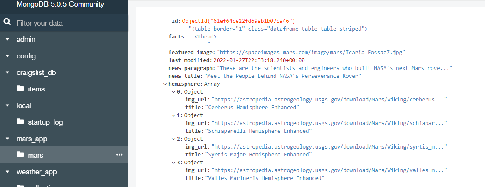
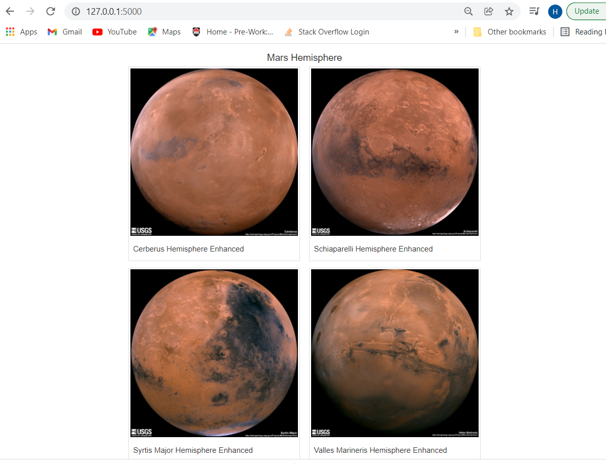
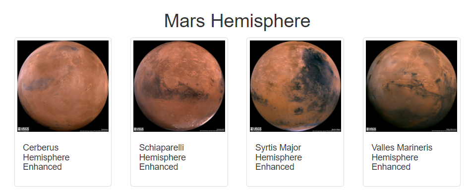
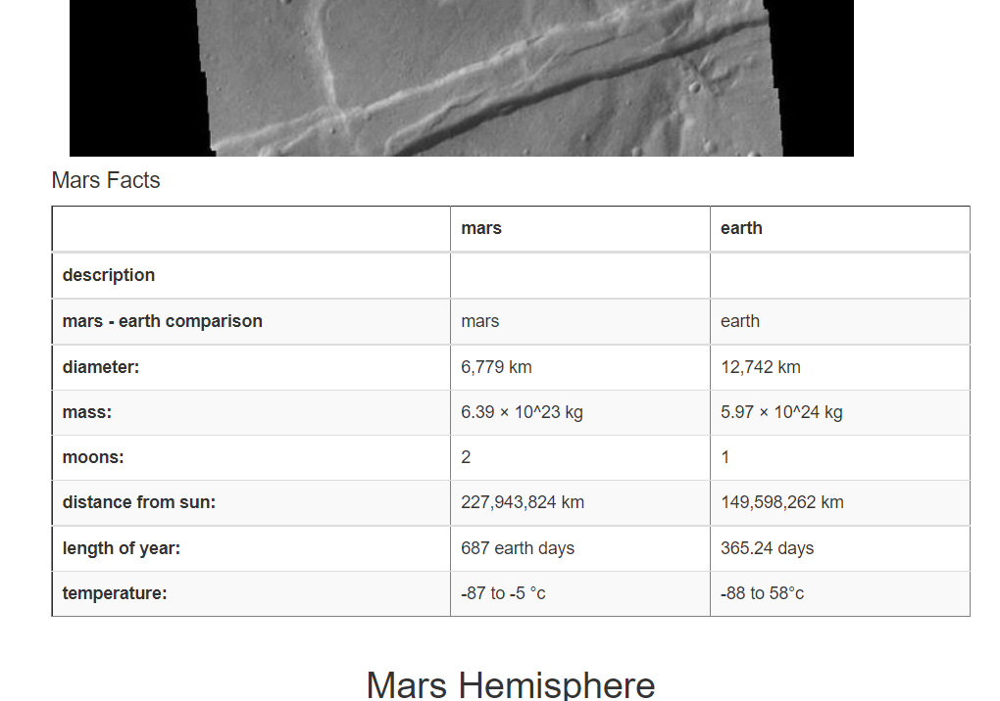

# Web Scraping --> Mission-to-Mars
## Purpose :
The purpose is to gather data about the mission to Mars from all over the web and display it in a central location. Data collected is stored in Mongo nosql db instead of using a sequel database. Also to build a web application that will scrape new data every time with a click of a button. Flask used as a web framework that allows to create web page using HTML and CSS. Also used bootstrap 3 to polish and customize the html. 
Instead of visiting each website and copying articles about Mars, this project will do web scraping and save the scraped data for later analysis and present it in html form.
## Tools used :
Beautiful soup, Splinter,Mongo, Nosql, Flask, Html, CSS, Bootstrap 3
## Results: 
The following image shows the scraped data stored in Mong db compass. This challenge collected full images of each link and title and stored in Mongo as a data dictionary.

The following image show the index.html where the Mongodb data is read and presented to the user in html format. It has a button to scrape new data as well. This image displays the Mars hemisphere in table two on each row with thumbnail.

The following images shows the index.html where the Mongodb data is retrieved and displayed on html file using flask and Bootstrap 3 components. The Mars hemisphere pictures with thumbnails and polished Mars facts table are styled using Bootstrap 3 components.

### Major points from the analysis:
This site is scraping-friendly with the use of flask, html, css and bootstrap 3 components ie. mobile responsive and styled with responsive images as seen above.

## Summary: 
In summary this project accomplished the use of BeautifulSoup and Splinter to scrape full-resolution images of Mars’s hemispheres and the titles of those images, stored the scraped data on a Mongo database, used a web application to display the data, and altered the design of the web app to accommodate these images.

